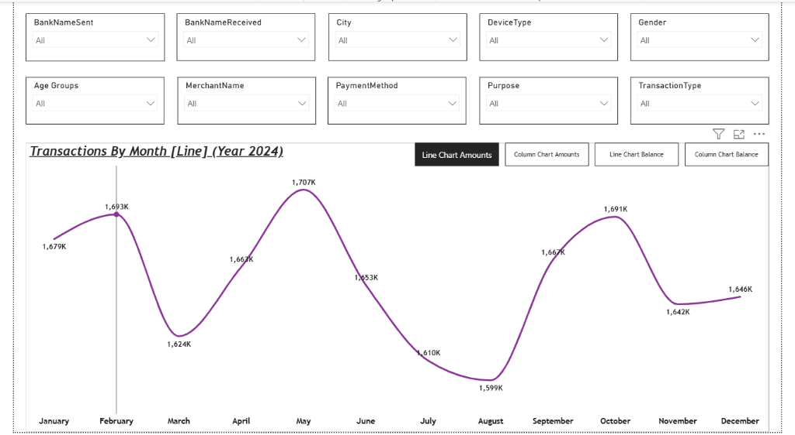
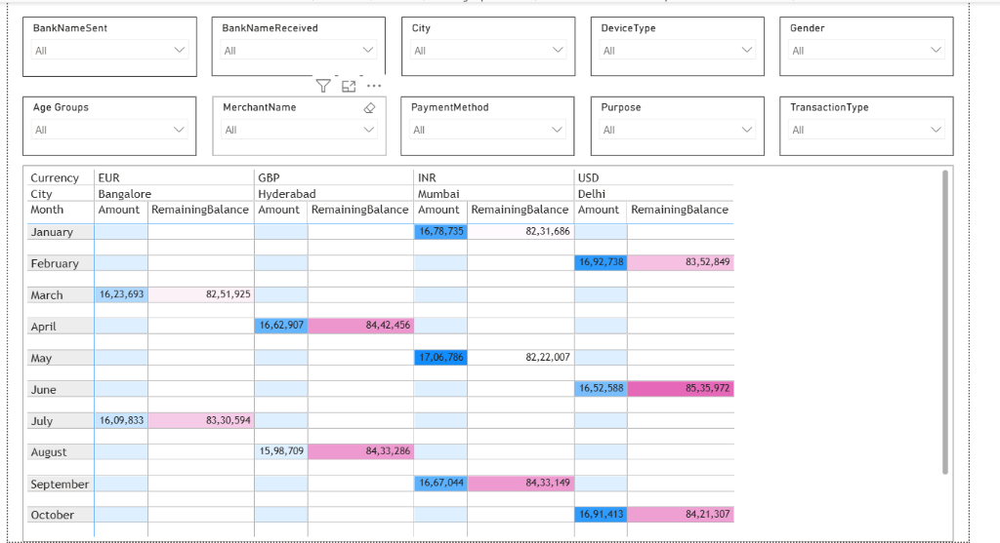

# UPI Transaction Intelligence Platform

An interactive Power BI dashboard for analyzing UPI transaction trends, customer behavior, and banking patterns to provide actionable business intelligence.

## Overview
This platform analyzes Unified Payments Interface (UPI) transaction data. Monitoring transaction volumes, values, and remaining balances provides critical insight into economic activity, demographic preferences, and digital payment adoption. The dashboard enables users to interactively investigate payment behavior across multiple dimensions including banks, geography, demographics, and device usage.

## Download & Open the Dashboard

The GitHub source repository contains the source-controlled PBIP structure, while the GitHub Release provides a packaged downloadable version for users who simply want to open the dashboard.

[Download Power BI Project v1.0.0](../../releases/download/v1.0.0/UPI-Transaction-Intelligence-Platform-v1.0.0.zip)

1. Download the Power BI project ZIP.
2. Extract the archive.
3. Open the extracted project folder.
4. Double-click `UPI-Transaction-Intelligence-Platform.pbip`.
5. Open the project using Power BI Desktop.

Requires Microsoft Power BI Desktop.

## Dashboard Preview

### Transaction Overview



### Balance Analysis



## Business Questions
The implemented dashboard can answer several critical business questions, such as:
- How do transaction amounts and volumes vary month by month?
- How does the remaining balance change over time for different demographic segments?
- How do transaction patterns differ depending on the sending or receiving bank?
- How do different cities compare in terms of transaction value?
- How do payment methods and device preferences differ across age groups?
- How do merchant, purpose, and transaction type filters affect the overall transaction landscape?

## Dashboard Pages

### Transaction Overview
The Transaction Overview page provides a macro view of the transactional data.
- Analyzes monthly transaction trends using transaction counts and total amounts.
- Offers interactive slicing by bank names (both sent and received), city, merchant name, and transaction type.
- Allows users to drill down into specific segments, such as identifying the transaction behavior for a particular bank in a specific city.

### Balance Analysis
The Balance Analysis page focuses on the financial health and distribution of funds post-transaction.
- Monitors remaining balance trends.
- Analyzes balance distribution across different customer demographics (Age Groups, Gender) and currency.
- Provides interactive capabilities to filter the balance data by various dimensions to understand which customer segments retain the highest balances.

## Interactive Analysis
The dashboard incorporates comprehensive interactive slicers that allow users to transition from broad, high-level transaction patterns to specific customer, merchant, banking, geographic, device, and payment behavior. Selecting a specific dimension (e.g., a specific age group or device type) dynamically filters all related visuals, enabling an intuitive, exploratory analysis experience.

## Data Model
The project uses a clean, single-table semantic model to power the analytics.
- **Table**: `UPI Transactions`
- **Important Columns**: `TransactionID`, `TransactionDate`, `Amount`, `RemainingBalance`, `BankNameSent`, `BankNameReceived`, `City`, `Gender`, `PaymentMethod`, `DeviceType`, `MerchantName`, `Purpose`
- **Calculated Columns**: Includes custom logic such as `Age Groups` (`A1` for <=25, `A2` for 26-35, `A3` for >35) for demographic segmentation.
- **Relationships**: As a flat, single-table model, no complex star schema relationships are required. All slicing occurs directly on the main transaction table.

## Key Analytical Capabilities
- Monthly transaction trend analysis
- Remaining balance monitoring
- Bank-to-bank transaction filtering (Sent vs. Received)
- City-level geographical analysis
- Merchant and purpose-based filtering
- Payment method and device segmentation
- Demographic filtering (Age Groups, Gender)
- Transaction-type analysis (e.g., Peer-to-Peer, Peer-to-Merchant)

## Tools & Technologies
- Microsoft Power BI Desktop
- Power BI Project (PBIP) format
- PBIR (Power BI Report format)
- TMDL (Tabular Model Definition Language)
- Git & GitHub

## Repository Structure
```
UPI-Transaction-Intelligence-Platform/
├── UPI-Transaction-Intelligence-Platform.pbip
├── UPI-Transaction-Intelligence-Platform.Report/
├── UPI-Transaction-Intelligence-Platform.SemanticModel/
├── assets/
│   ├── README.md
│   └── screenshots/
├── docs/
│   ├── project-overview.md
│   ├── dashboard-features.md
│   ├── data-model.md
│   └── repository-structure.md
├── README.md
├── LICENSE
└── .gitignore
```
This repository leverages the modern PBIP format, which separates the report definitions (`.Report/`) from the semantic data model (`.SemanticModel/`), making it highly source-control friendly compared to monolithic PBIX files.

## How to Open the Project
1. Clone the repository to your local machine.
2. Ensure you have a compatible version of **Microsoft Power BI Desktop** installed.
3. Open the `UPI-Transaction-Intelligence-Platform.pbip` file using Power BI Desktop.
4. Allow Power BI Desktop to load the report and semantic model.
5. Review data-source settings in Power Query if local source paths require adjustment (the current source is a local Excel file).
6. Explore the Transaction Overview and Balance Analysis report pages.

## Project Documentation
Detailed documentation is available in the `docs/` directory:
- [Project Overview](docs/project-overview.md)
- [Dashboard Features](docs/dashboard-features.md)
- [Data Model](docs/data-model.md)
- [Repository Structure](docs/repository-structure.md)

## Project Status
This is a completed Data Analytics portfolio project designed for local interaction via Power BI Desktop.

## Author
**Dasari Chaithanya Sidhartha**
